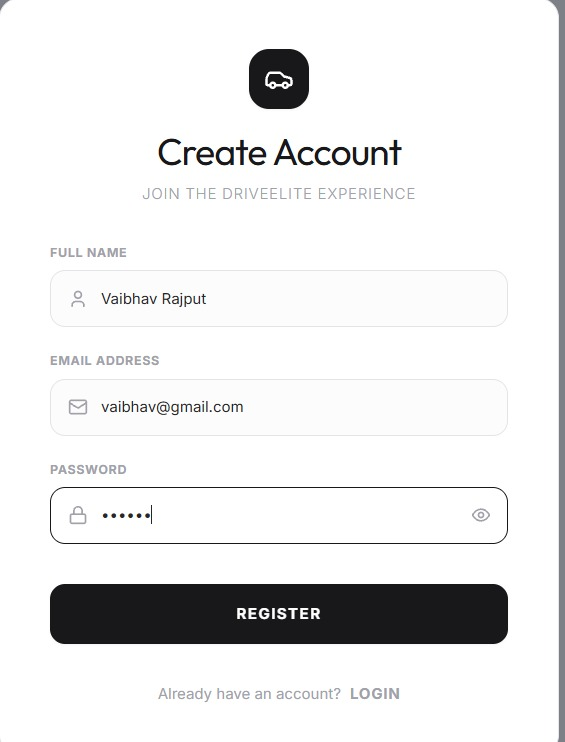
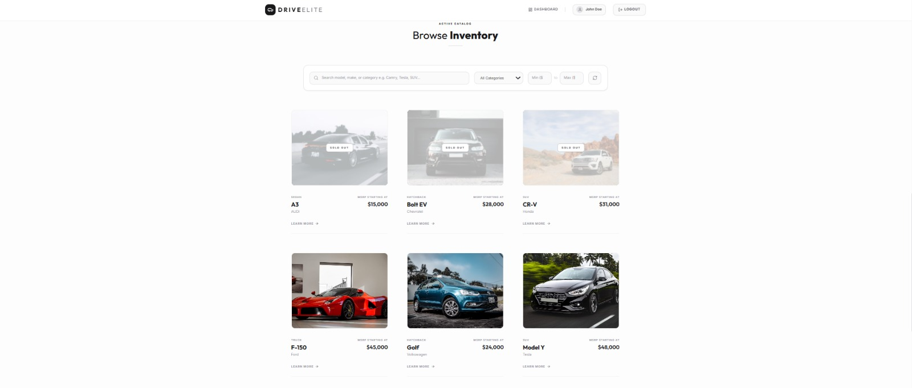
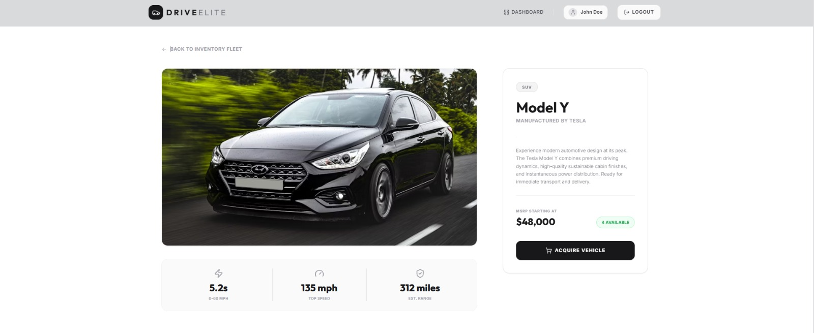
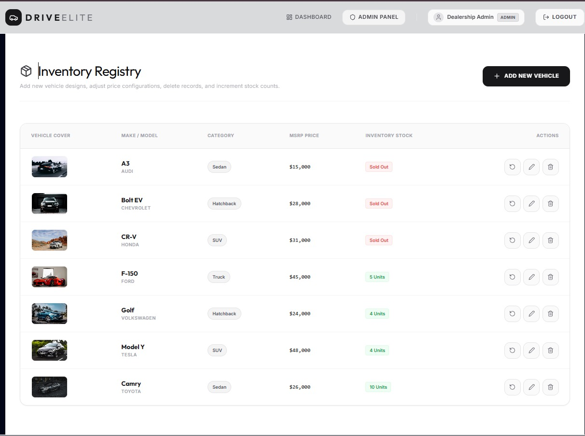
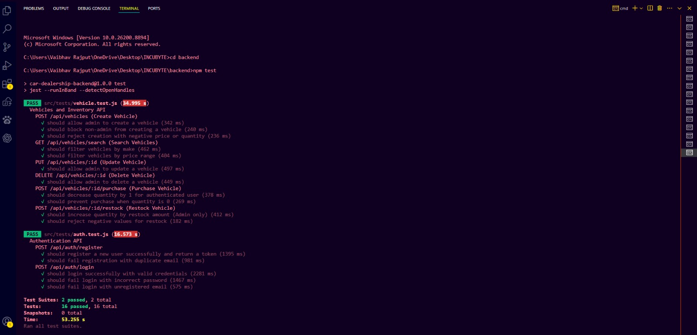

# DriveElite | Car Dealership Inventory System

A complete, full-stack Car Dealership Inventory System built with the MERN stack (MongoDB, Express, React, Node.js) that satisfies all authentication, authorization, vehicle search, and inventory restocking business logic.

---

## Project Overview

DriveElite is a premium dealership inventory workspace designed to streamline vehicle procurement and catalog management. The application splits functionalities between standard users (who browse catalogs and purchase available cars) and administrative accounts (who manage vehicle details, restock vehicles, and delete entries).

## Features

* **JWT Authentication:** Secure cookie/bearer token login, register, and logout.
* **Role-Based Access Control:** Differentiates interfaces and access rights between `user` and `admin` roles.
* **Smart Search & Filtering:** Filter the vehicle fleet dynamically by manufacturer (make), category (Sedan, SUV, Hatchback, Truck), and custom price limits.
* **Inventory Control & Business Rules:**
  * **Purchase:** Standard users can purchase cars, reducing inventory stock by 1. The button is disabled and marked "Out of Stock" if stock hits 0.
  * **Restock:** Administrators can restock units by adding any positive integer to the inventory count. Negative values are prevented.
* **Comprehensive Test Coverage:** Integration tests for authentication endpoints and inventory business rules written with Jest and Supertest.
* **Centralized Error Handling:** Formatted JSON responses covering Validation errors, cast errors, duplicate values, and unauthorized access.

## Tech Stack

* **Frontend:** React (Vite), Tailwind CSS, React Router, Axios, Lucide Icons
* **Backend:** Node.js, Express.js, MongoDB with Mongoose, JWT, bcryptjs
* **Testing:** Jest + Supertest with `mongodb-memory-server`

---

## Installation & Directory Structure

```text
/
├── backend/            # Express REST API, Mongoose Models, Jest Tests
│   ├── src/
│   │   ├── controllers/
│   │   ├── routes/
│   │   ├── models/
│   │   ├── middleware/
│   │   ├── tests/
│   │   └── app.js
│   ├── server.js
│   └── package.json
├── frontend/           # React SPA, Vite, Tailwind CSS
│   ├── src/
│   │   ├── pages/
│   │   ├── components/
│   │   ├── services/
│   │   ├── context/
│   │   ├── layouts/
│   │   └── App.jsx
│   └── package.json
└── package.json        # Workspace orchestration scripts
```

### Environment Variables

Create a `.env` file in the `/backend` folder with the following properties:

```env
PORT=5090
MONGODB_URI=your_mongodb_atlas_connection_string
JWT_SECRET=your_jwt_secret
JWT_EXPIRES_IN=1d
NODE_ENV=development
```

---

## Setup Instructions

### 1. Install Dependencies
From the root directory, run:
```bash
npm run install:all
```

### 2. Seed the Database
Configure your MongoDB Atlas connection string in backend/.env and then run:

```bash
npm run seed:backend
```
*Creates default accounts:*
* **Admin:** `admin@dealership.com` / `adminpassword123`
* **User:** `john@example.com` / `userpassword123`

### 3. Run Backend
```bash
npm run start:backend
```
Runs the server on [http://localhost:5090](http://localhost:5090)

### 4. Run Frontend
```bash
npm run start:frontend
```
Runs the React app on [http://localhost:3000](http://localhost:3000)

---

## Running Tests

To run the automated Jest integration tests:
```bash
npm run test:backend
```
*Note: Tests run against an isolated in-memory MongoDB database server (`mongodb-memory-server`), ensuring local database collections remain untouched.*

---

## API Endpoints List

### Authentication
* `POST /api/auth/register` - Create standard user account
* `POST /api/auth/login` - Verify credentials and return token
* `POST /api/auth/logout` - Clear user session

### Vehicles & Inventory
* `GET /api/vehicles` - List all vehicles (Protected)
* `GET /api/vehicles/search` - Query list by `make`, `model`, `category`, `minPrice`, `maxPrice` (Protected)
* `POST /api/vehicles` - Add new vehicle (Protected, Admin only)
* `PUT /api/vehicles/:id` - Update vehicle information (Protected, Admin only)
* `DELETE /api/vehicles/:id` - Delete vehicle record (Protected, Admin only)
* `POST /api/vehicles/:id/purchase` - Purchase 1 unit from stock (Protected)
* `POST /api/vehicles/:id/restock` - Increase stock level (Protected, Admin only)

---

## Screenshots Section
## Screenshots

### Homepage


### Login Page


### Registration Page


### User Dashboard


### Vehicle Details


### Admin Dashboard


## Test Results

All backend integration tests passed successfully.



---
## Test Results

All backend integration tests passed successfully using Jest, Supertest, and mongodb-memory-server.

- Test Suites: 2 passed, 2 total
- Tests: 16 passed, 16 total
- Authentication API tests: Passed
- Vehicle Inventory API tests: Passed


## Render Deployment Instructions

This project is prepared for deployment on **Render** (https://render.com) using either the automated Blueprint specification (`render.yaml`) or manual dashboard configurations.

### Option 1: Automated Deployment via Render Blueprint (Recommended)

Render Blueprints allow you to deploy the entire stack automatically using the `render.yaml` file located in the root of the repository.

1. Push your project repository to GitHub or GitLab.
2. Go to the **Render Dashboard**, click **New**, and select **Blueprint**.
3. Connect your repository.
4. Render will automatically read the `render.yaml` file and configure:
   - A Web Service for the backend.
   - A Static Site for the frontend.
5. In the Render UI, fill in the prompted environment variables:
   - `MONGODB_URI`: Your production MongoDB Atlas connection string.
   - `FRONTEND_URL`: The URL of your deployed frontend (you will receive this after the frontend service is created, usually in the format `https://<frontend-service-name>.onrender.com`).
   - `VITE_API_URL`: The URL of your deployed backend API (usually in the format `https://<backend-service-name>.onrender.com/api`).
6. Click **Apply** to deploy the services.

---

### Option 2: Manual Deployment

If you prefer to deploy each service manually through the Render Dashboard:

#### A. Backend Web Service
1. In Render, click **New > Web Service**.
2. Connect your repository.
3. Configure the following settings:
   - **Name:** `car-dealership-backend`
   - **Environment:** `Node`
   - **Region:** Choose the region closest to your database
   - **Root Directory:** `backend`
   - **Build Command:** `npm install`
   - **Start Command:** `npm start`
4. Add the following **Environment Variables**:
   - `NODE_ENV`: `production`
   - `PORT`: `5090`
   - `MONGODB_URI`: *Your MongoDB Atlas connection string*
   - `JWT_SECRET`: *A secure random secret key*
   - `JWT_EXPIRES_IN`: `1d`
   - `FRONTEND_URL`: *The URL of your deployed frontend (e.g., `https://car-dealership-frontend.onrender.com`)*

#### B. Frontend Static Site
1. In Render, click **New > Static Site**.
2. Connect your repository.
3. Configure the following settings:
   - **Name:** `car-dealership-frontend`
   - **Root Directory:** `frontend`
   - **Build Command:** `npm install && npm run build`
   - **Publish Directory:** `dist`
4. Add the following **Environment Variables**:
   - `VITE_API_URL`: *The URL of your backend service (e.g., `https://car-dealership-backend.onrender.com/api`)*
5. Configure **Redirect/Rewrite Rules** (required for React Router fallback):
   - Go to **Redirects/Rewrites** tab for the static site service.
   - Add a rule:
     - **Source:** `/*`
     - **Destination:** `/index.html`
     - **Action:** `Rewrite`

---

### Required Environment Variables Summary

#### Backend Service
| Variable Name | Description | Example / Recommended Value |
| :--- | :--- | :--- |
| `PORT` | The port the Express server binds to | `5090` (Render defaults to 10000 if not specified, but 5090 matches render.yaml) |
| `NODE_ENV` | Mode of operation | `production` |
| `MONGODB_URI` | Connection URI for the MongoDB database | `mongodb+srv://<username>:<password>@cluster0.pxugdwy.mongodb.net/car_dealership` |
| `JWT_SECRET` | Secret key used to sign and verify JSON Web Tokens | *Any long random secure string* |
| `JWT_EXPIRES_IN` | Validity duration of the authentication token | `1d` |
| `FRONTEND_URL` | Deployed URL of your frontend static site (for CORS) | `https://car-dealership-frontend.onrender.com` |

#### Frontend Service
| Variable Name | Description | Example / Recommended Value |
| :--- | :--- | :--- |
| `VITE_API_URL` | Base URL of the backend API (injected at build time) | `https://car-dealership-backend.onrender.com/api` |

---

### MongoDB Atlas Whitelisting
To allow the Render backend to connect to MongoDB Atlas:
1. Log in to your **MongoDB Atlas** dashboard.
2. Go to **Network Access**.
3. Click **Add IP Address**.
4. Since Render Web Services on the free plan use dynamic IP addresses, you should whitelist all IPs (`0.0.0.0/0`). Alternatively, if you use a paid Render tier, you can bind static outbound IP addresses and whitelist those.

---

## My AI Usage

### AI Tools Used
* Google Gemini and ChatGPT

### How they were Used
* Created the backend architecture, Express configuration, Mongoose schemas, and routes.
* Developed the in-memory testing strategy with Jest, Supertest, and `mongodb-memory-server`.
* Styled the React UI components with responsive cards, glassmorphic navigations, search fields, and admin management actions.

### Reflection
* **Strengths:** Generating template code and designing complex Tailwind designs was extremely efficient. Organizing backend routing structures using standard patterns saved substantial development time.
* **Limitations:** Context coordination when dealing with file updates over separate terminal environments require careful sequencing to ensure the tests run sequentially and standard mock data is cleanly cleaned up.
